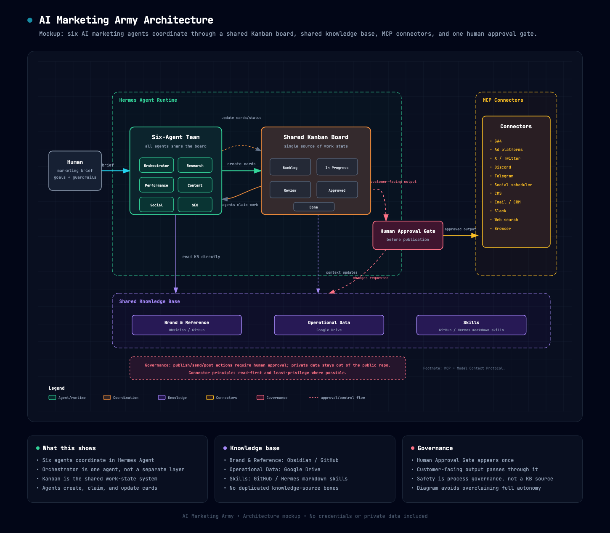

# AI Marketing Army

A working proof-of-concept for an AI-powered growth marketing team.

Six specialist agents coordinate through a shared Kanban board, read from a structured knowledge base, and produce marketing work with humans approving anything customer-facing. The system runs on [Hermes Agent](https://github.com/NousResearch/hermes-agent), an open-source autonomous agent platform.

This repo documents the architecture, agent roles, workflows, and operating principles. It's framed as a portfolio piece showing how one marketer can build genuine leverage from AI infrastructure, not just prompt a chatbot.

## What this demonstrates

- Multi-agent orchestration via a shared Kanban board
- Specialist agent design with defined roles, tools, and handoffs
- Three-layer knowledge base architecture: brand docs, operational data, and reusable skills
- MCP connector design for reading and writing to external systems
- Human-in-the-loop approval gates for customer-facing output
- Practical safety, privacy, and source-handling standards
- Clear documentation for non-technical stakeholders

## Current status

**Stage:** Working proof of concept.

The architecture is designed and documented. The components are intended to run on synthetic or sanitised demo data for portfolio purposes. Real data sources, credentials, and connectors would plug in when adapting the system for an employer or client.

## System architecture

The system has four layers sitting on top of the Hermes Agent runtime:

1. **Agents** — Six specialists, each with a narrow remit
2. **Coordination** — A Kanban board where agents claim work, pass tasks, and produce output
3. **Knowledge base** — Three structured sources the agents read from
4. **External connectors** — MCP connectors to read from and write to external tools

A human approval gate sits between the system and any customer-facing output.

See [`docs/architecture.md`](docs/architecture.md) for the full architecture.

Interactive HTML version: [`diagrams/architecture-mockup.html`](diagrams/architecture-mockup.html)

## The agents

Six specialists, each with one job:

- 🎯 **Orchestrator** — Grooms the Kanban, breaks marketing briefs into tasks, assigns to specialists, compiles shift reports
- 🔍 **Research** — Tracks industry trends, competitor moves, social sentiment, and vertical insights
- 📊 **Performance Analyst** — Reads analytics and ad platform data, surfaces what's working, designs experiments
- ✍️ **Content** — Produces blog posts, long-form pieces, and thought leadership, all run through the brand voice guide
- 📣 **Social & Community** — Drafts and schedules content for X, Discord, and Telegram, monitors sentiment
- 🔎 **SEO** — Keyword research, on-page optimisation, content gap analysis, internal linking

Each agent has its own system prompt, tool access, handoff rules, and MCP connector assumptions. See [`docs/agent-roles.md`](docs/agent-roles.md) for the full specs.

## Knowledge base

Three layers, each with a different purpose and lifecycle:

- **Brand and reference** — Obsidian, synced via GitHub. Voice, positioning, ICPs, glossary, product specs
- **Operational data** — Google Drive. Analytics exports, customer research, campaign performance, competitor intel
- **Skills** — GitHub. Hermes skills as markdown: reusable, versioned procedures

Splitting these keeps prompts narrow, citations cleaner, and public/private boundaries easier to manage. See [`docs/knowledge-base.md`](docs/knowledge-base.md).

## Repo map

- [`docs/architecture.md`](docs/architecture.md) — Full system architecture and design principles
- [`docs/agent-roles.md`](docs/agent-roles.md) — Six specialist agent specs
- [`docs/workflows.md`](docs/workflows.md) — Kanban-based marketing workflows
- [`docs/knowledge-base.md`](docs/knowledge-base.md) — Three-layer knowledge architecture
- [`docs/mcp-connectors.md`](docs/mcp-connectors.md) — Connector assumptions and boundaries
- [`docs/evaluation.md`](docs/evaluation.md) — Output quality gates and review scorecards
- [`docs/privacy-and-safety.md`](docs/privacy-and-safety.md) — Public/private boundaries and safety rules
- [`prompts/`](prompts/) — Starter prompt templates for each agent
- [`examples/`](examples/) — Sanitised demo inputs and outputs
- [`obsidian/`](obsidian/) — Suggested private knowledge-base structure
- [`roadmap.md`](roadmap.md) — Build plan

## Public vs private boundary

This public repo contains architecture, examples, and safe templates. It does **not** contain private job-search notes, contact lists, employer-specific application materials, API keys, credentials, or raw operational data.

The intended split is:

- **GitHub:** public showroom — clean architecture, examples, prompts, and proof of capability
- **Obsidian:** private workshop — brand/reference knowledge, messy notes, drafts, and operating memory
- **Google Drive:** private operational data — analytics exports, campaign data, research files
- **Hermes skills:** reusable operating procedures that can be versioned and audited

## Why this exists

This project is designed to demonstrate practical AI fluency in a marketing context: not just using chatbots, but designing repeatable systems that combine research, strategy, creative judgement, automation, review, and operational discipline.
