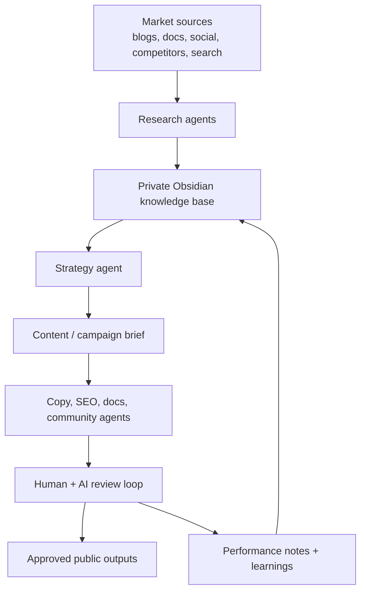

# AI Marketing Army

A public proof-of-concept for an AI-assisted marketing operating system.

The goal is to show how one marketer can use AI agents, structured knowledge management, and human review loops to get the leverage of a small research, strategy, content, SEO, and analytics team.

This repo is intentionally framed as a **portfolio architecture project**: it documents the system design, workflows, prompts, evaluation approach, and safe operating principles. The private working knowledge base lives separately in Obsidian.

## What this demonstrates

- Agentic workflow design for marketing tasks
- Research-to-strategy-to-content pipelines
- Prompt and role design for specialist agents
- Human-in-the-loop review and quality control
- Knowledge-base architecture using Obsidian
- Practical safety, privacy, and source-handling standards
- Clear documentation for non-technical stakeholders

## Current status

**Stage:** Architecture and proof of concept.

This is not presented as a fully autonomous marketing department. It is an evolving system design for using AI responsibly and effectively in marketing work.

## System concept

## Repo map

- [`docs/architecture.md`](docs/architecture.md) — system architecture and design principles
- [`docs/agent-roles.md`](docs/agent-roles.md) — specialist agent roles
- [`docs/workflows.md`](docs/workflows.md) — core marketing workflows
- [`docs/evaluation.md`](docs/evaluation.md) — how outputs are judged
- [`docs/privacy-and-safety.md`](docs/privacy-and-safety.md) — public/private boundaries and safety rules
- [`prompts/`](prompts/) — starter prompt templates for agent roles
- [`examples/`](examples/) — sanitised demo inputs and outputs
- [`obsidian/`](obsidian/) — suggested private knowledge-base structure
- [`roadmap.md`](roadmap.md) — build plan

## Public vs private boundary

This public repo contains architecture, examples, and safe templates. It does **not** contain private job-search notes, contact lists, employer-specific application materials, API keys, credentials, or raw scraped data.

The intended split is:

- **GitHub:** public showroom — clean architecture, examples, and proof of capability
- **Obsidian:** private workshop — messy research, personal notes, target companies, drafts, and operating memory

## Why this exists

This project is designed to demonstrate practical AI fluency in a marketing context: not just using chatbots, but designing repeatable systems that combine research, strategy, creative judgement, automation, and review.
