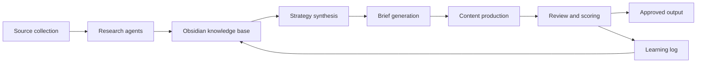

# Architecture

## Framing

The AI Marketing Army is a modular marketing operating system. It uses specialist AI agents for repeatable marketing tasks, with a human marketer acting as editor, strategist, and decision-maker.

The system is not meant to remove human judgement. It is meant to compress the time between market signal, strategic interpretation, and useful marketing output.

## Design principles

1. **Human-led, AI-assisted** — agents produce drafts and analysis; a human approves important decisions.
2. **Knowledge-first** — reusable context lives in a structured knowledge base rather than being rediscovered every time.
3. **Small specialist roles** — each agent has a narrow job, making outputs easier to evaluate.
4. **Traceable sources** — research outputs should link back to source material.
5. **Public/private separation** — portfolio-safe docs live in GitHub; sensitive working notes live in Obsidian.
6. **Review loops over full autonomy** — quality control is a feature, not an afterthought.

## High-level components

## Components

### 1. Source collection

Collects market signals from sources such as company blogs, competitor websites, product docs, social posts, newsletters, podcasts, search results, and community discussions.

### 2. Research agents

Turn raw sources into structured notes: summaries, claims, evidence, competitor moves, customer pain points, and open questions.

### 3. Obsidian knowledge base

The private operating memory. It stores source notes, company profiles, topic maps, messaging hypotheses, content briefs, and lessons learned.

### 4. Strategy agent

Synthesises research into positioning, narrative angles, audience insights, and campaign recommendations.

### 5. Production agents

Draft outputs such as LinkedIn posts, blog outlines, landing-page copy, SEO briefs, campaign concepts, and documentation improvements.

### 6. Review layer

Checks quality, accuracy, source support, tone, strategic fit, privacy, and whether a human should approve before publishing.

## Proof-of-concept boundary

The first version focuses on architecture and repeatable workflow design, not full automation. A credible proof of concept can be mostly documentation plus a few sanitised demo runs.
