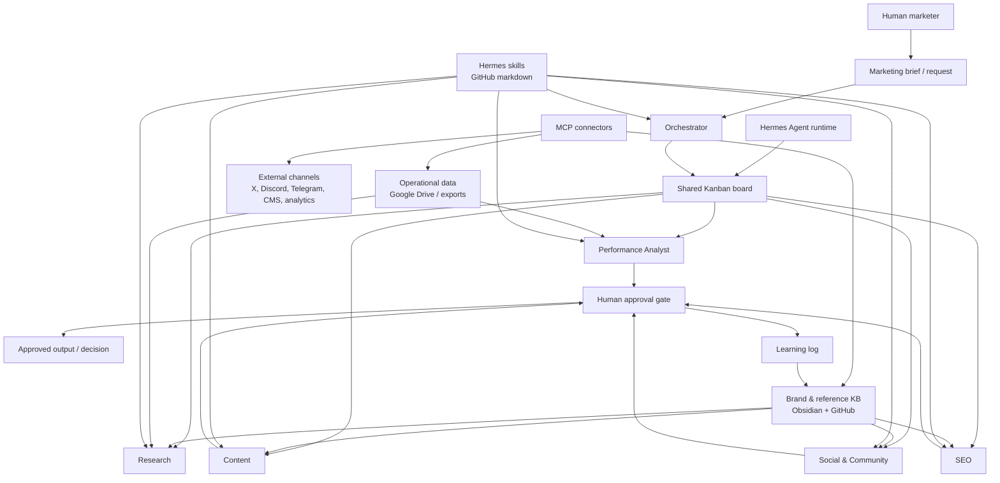

# Architecture

## Framing

AI Marketing Army is a working proof-of-concept for an AI-powered growth marketing team. It uses Hermes Agent as the runtime, a shared Kanban board for coordination, a three-layer knowledge base for context, and MCP connectors for external systems.

The system is human-led. Agents can research, analyse, draft, and recommend, but a human approves anything customer-facing or reputationally sensitive.

## Design principles

1. **Human-led, agent-assisted** — agents do specialist work; humans approve strategy and external output.
2. **Narrow specialist roles** — each agent has a defined remit, toolset, and handoff contract.
3. **Kanban as the coordination layer** — work is visible, assignable, reviewable, and auditable.
4. **Knowledge before generation** — agents read from structured context before producing output.
5. **Separation of knowledge layers** — brand/reference, operational data, and reusable skills have different storage and privacy needs.
6. **Connector boundaries** — MCP connectors expose the minimum required read/write access to external tools.
7. **Approval gates** — no customer-facing publishing without human sign-off.

## High-level system

## Layers

### 1. Hermes Agent runtime

Hermes provides the local agent environment, tool access, memory, skills, and task execution. In this proof of concept, Hermes is the base layer the agent team runs on.

### 2. Agent team

Six specialist profiles execute work:

- Orchestrator
- Research
- Performance Analyst
- Content
- Social & Community
- SEO

Each agent has a narrow remit and a defined handoff format. This avoids one giant vague assistant trying to do everything.

### 3. Shared Kanban board

The Kanban board is the coordination layer. It records what needs doing, who owns it, what depends on what, and whether work is blocked, ready, in progress, under review, or complete.

This matters because multi-agent systems need visible state. Without a shared board, work becomes hidden inside chats.

### 4. Knowledge base

The knowledge base has three layers:

- **Brand and reference:** durable context in Obsidian, synced via GitHub
- **Operational data:** changing performance/customer data in Google Drive or equivalent stores
- **Skills:** reusable operating procedures stored as versioned markdown

See [`knowledge-base.md`](knowledge-base.md).

### 5. MCP connectors

MCP connectors are the integration layer. They let agents read and write to external systems with explicit boundaries. In a real deployment, connectors might expose Google Drive, analytics exports, a CMS, X, Discord, Telegram, Linear, Notion, or other systems.

See [`mcp-connectors.md`](mcp-connectors.md).

### 6. Human approval gate

Drafts, recommendations, and customer-facing outputs go through a human approval gate. The gate catches hallucinated claims, off-brand messaging, privacy issues, and strategic misalignment.

## Proof-of-concept boundary

For portfolio purposes, the system can run on synthetic data and sanitised examples. The aim is to demonstrate architecture, agent design, handoffs, safety thinking, and operating discipline — not to expose private employer or job-search material.
