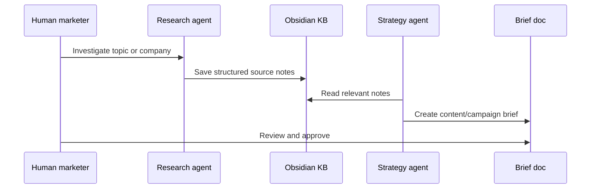

# Workflows

## Workflow 1: Market signal to content brief

## Workflow 2: Brief to draft outputs

1. Human approves a brief.
2. Copywriter drafts multiple content angles.
3. SEO Analyst suggests search-led version if relevant.
4. Reviewer checks accuracy, tone, and strategic fit.
5. Human chooses what to publish or save.

## Workflow 3: Learning loop

1. Capture what was published.
2. Add performance notes or qualitative feedback.
3. Store learnings in Obsidian.
4. Feed learnings into the next brief.

## Workflow 4: Employer-facing demo

1. Pick a public, non-sensitive topic.
2. Run a small research-to-brief workflow.
3. Publish sanitised examples in this repo.
4. Explain what the system did, what the human reviewed, and what would improve next.
