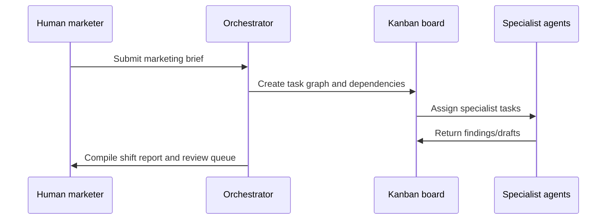

# Workflows

The system works through Kanban. The Orchestrator decomposes requests, agents complete specialist subtasks, and a human approval gate controls customer-facing output.

## Workflow 1: Marketing brief to task graph

**Example task graph:**

1. Research: summarise market context and competitor positioning
2. Performance Analyst: review relevant performance exports
3. SEO: identify search opportunities
4. Content: draft long-form asset from approved brief
5. Social & Community: adapt approved angle into channel-native drafts
6. Orchestrator: compile review packet for human approval

## Workflow 2: Research to strategy packet

1. Orchestrator creates a Research task from a brief.
2. Research reads public sources and brand/reference docs.
3. Research writes a source-backed findings note.
4. Orchestrator creates downstream Content, SEO, or Social tasks based on findings.
5. Human reviews any strategic assumptions before public-facing production.

## Workflow 3: Performance to experiment

1. Performance Analyst reads campaign or analytics exports from the operational data layer.
2. It identifies what appears to be working, underperforming, or unclear.
3. It proposes experiments with measurement criteria.
4. Orchestrator creates follow-up tasks for Content, Social, or SEO.
5. Human approves the experiment before launch.

## Workflow 4: Draft to approval

1. Content, Social, or SEO produces a draft.
2. Draft includes sources, assumptions, and claims that need checking.
3. Reviewer/human checks accuracy, tone, privacy, and strategic fit.
4. Approved work can be published or scheduled.
5. Rejected/revised work returns to Kanban with specific feedback.

## Workflow 5: Learning loop

1. Capture what was shipped.
2. Capture performance or qualitative feedback.
3. Performance Analyst converts results into a learning note.
4. The knowledge base is updated.
5. Future briefs use those learnings.

## Workflow 6: Employer-facing demo

1. Pick a public, non-sensitive topic.
2. Run a synthetic research → strategy → draft → review workflow.
3. Save sanitised examples in this repo.
4. Explain what the system did, what the human reviewed, and what would plug into real company systems.
